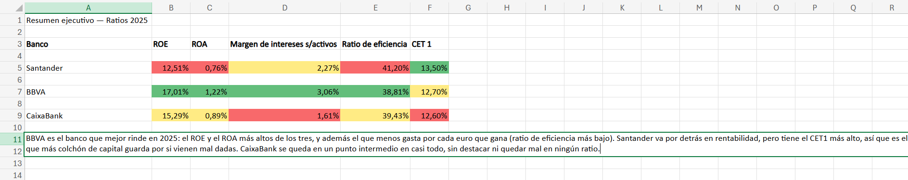

# Comparativa de Ratios Financieros — Santander, BBVA y CaixaBank

Análisis comparativo de la salud financiera de los tres bancos españoles más grandes, usando datos reales de sus resultados de 2025 y 2024. Todo el trabajo está hecho en Excel: desde los datos en bruto hasta un resumen tipo dashboard con formato condicional.

**Autor:** Alberto Gallego · proyecto 2 de portafolio (banca / finanzas)

Después del primer proyecto con datos de retail, quería meterme en el sector que más me interesa para trabajar: banca. Elegí comparar los tres bancos españoles más grandes porque son los que todo el mundo conoce, y porque sus informes de resultados son públicos y se pueden verificar fácilmente.

## Pregunta de negocio

¿Cómo se comparan Santander, BBVA y CaixaBank en rentabilidad, eficiencia y solvencia en 2025?

## Fuentes de datos

Todos los datos vienen de fuentes oficiales: los informes de resultados de 2025 y 2024 publicados por cada banco (sala de prensa / relación con inversores de Santander, BBVA y CaixaBank). En los casos donde el informe no detallaba activos totales o patrimonio de forma directa, usé stockanalysis.com como fuente secundaria para estandarizar esas cifras. Cada dato lleva su fuente anotada en la columna "Notas" de la hoja "Datos" del Excel, y donde un dato no estaba disponible en ningún sitio (como la morosidad de Santander), lo dejé en blanco en vez de inventarlo.

## Proceso

Este proyecto está hecho casi entero en Excel, que es mi herramienta más fuerte.

1. **Datos:** recopilé beneficio neto, activos, patrimonio, margen de intereses, gastos de explotación y ratios de capital de los 3 bancos, para 2024 y 2025.
2. **Ratios:** calculé con fórmulas (nada metido a mano) el ROE, ROA, margen de intereses sobre activos, ratio de eficiencia y CET1 de cada banco y año.
3. **Tabla dinámica:** aquí quiero ser honesto. Mi primera idea era usar Power Query para automatizar la reestructuración de los datos, pero descubrí que la versión gratuita de Excel Online (sin licencia de Microsoft 365) no incluye el editor de Power Query — solo deja ver y actualizar consultas que ya existan, no crear nuevas. Como alternativa, reestructuré los datos a mano en formato largo y construí una tabla dinámica con gráfico dinámico, que permite filtrar por año y comparar los 3 bancos de un vistazo.
4. **Resumen ejecutivo:** una hoja final con los 5 ratios de 2025 y formato condicional (verde/amarillo/rojo) para ver de un vistazo qué banco gana en cada uno.

## Resultado



## Lo que encontré

BBVA es el banco que mejor rinde en 2025: tiene el ROE y el ROA más altos de los tres, y también es el que menos gasta por cada euro que gana. Santander se queda algo por detrás en rentabilidad, pero tiene el CET1 más alto, es decir, el colchón de capital más sólido para aguantar un mal momento. CaixaBank se mantiene en un punto intermedio en casi todos los ratios, sin destacar mucho pero tampoco quedando mal en ninguno.

## Estructura del repositorio

```
excel/                → datos_bancos.xlsx (datos, ratios, tabla dinámica y resumen ejecutivo)
capturas/              → capturas de la tabla dinámica y del resumen ejecutivo
```

## Cómo reproducirlo

1. Abre `excel/datos_bancos.xlsx`.
2. La hoja "Datos" tiene los datos en bruto, con sus fuentes citadas en la columna "Notas".
3. La hoja "Ratios" calcula los 5 ratios con fórmulas.
4. La hoja "Datos-Largos" reestructura esos ratios en formato largo, la base para la tabla dinámica.
5. La hoja "Tabla dinamica" tiene la tabla y el gráfico dinámico, filtrables por año.
6. La hoja "Resumen ejecutivo" tiene la vista final con formato condicional y la conclusión.
